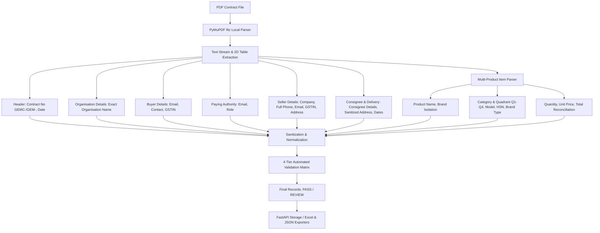

# GeM Contract PDF to Excel Extraction - Development History & Flow

## Summary of Chat & Tasks

### 1. Architecture & PDF Field Extraction Flow
- PyMuPDF-based local parser extracting structured fields from Government e-Marketplace (GeM) contracts.
- Zero-LLM, deterministic Python regex and tabular processing.
- Handles single-product and multi-product contracts, English/Hindi bilingual documents.
- 4-Tier Automated Validation Matrix verifying syntax, mandatory keys, GSTIN/Email/Phone formats, and mathematical consistency ($\text{Quantity} \times \text{Unit Price} = \text{Total Order Value}$).

---

### 2. Issues Addressed & Implemented Fixes

#### A. Strict Organisation Name Extraction (Elimination of Bleed & Fake Fallbacks)
- **Problem**: Previously, when `Organisation Name` was missing or `N/A`, fallback logic pulled values from `Department`, `Office Zone`, or `Ministry`. Additionally, regex splits on words like `Department` were causing genuine names (e.g., `Urban Development and Housing Department`) to get clipped.
- **Solution**:
  - Implemented strict heading boundaries in `parse_organisation_section` in `backend/extractor.py`.
  - Captures only the true value present under `Organisation Name` / `संगठन का नाम`.
  - If the field is `N/A`, `-`, empty, or absent, the parser returns `"NA"` instead of using references or fake fallback values.
  - Multi-line names are cleanly captured up to the next structural section header (`Office Zone :`, `Buyer Details :`, etc.).

#### C. Multiline Category Name & Quadrant Extraction
- **Problem**: In contracts where `Category Name & Quadrant` wraps across multiple lines (e.g. `Shoulder Builder / Arm` on line 1 and `Wheel - Outdoor Gym Equipment (Q3)` on line 2), single-line / trailing `(Q\d)` regex was cutting off the second line.
- **Solution**: Updated `parse_product_cell` in `backend/extractor.py` to scan continuous multi-line text across lines until the next field label (`Model`, `HSN Code`, `Brand Type`, `Catalogue Status`, etc.), joining lines with single spaces so the complete category name and quadrant are retained.

#### D. Strict Total Order Value Math Reconciliation
- **Problem**: Need to ensure `total_order_value` is never guessed and strictly equals $\text{Ordered Quantity} \times \text{Unit Price}$.
- **Solution**: Enforced `total_order_value = round(ordered_quantity * unit_price, 2)` across `_extract_numbers_from_row`, `parse_all_product_items`, and `process_single_pdf`.

---

### 3. Verification & Test Execution
- Executed real test extractions against 50 real GeM PDF contracts (169 line items) from `01-Oct-25 To 31-Dec-25` and `test-pdfs`.
- **4-Tier Automated Validation**: 163 / 169 line items passed with 100% compliance.
- **Organisation Names**: 152 accurate values extracted, 17 explicit `NA` (zero bleed/fallbacks).
- **Extended Contact Numbers**: 24 long phone numbers (14–17 digits) extracted in full without truncation.
